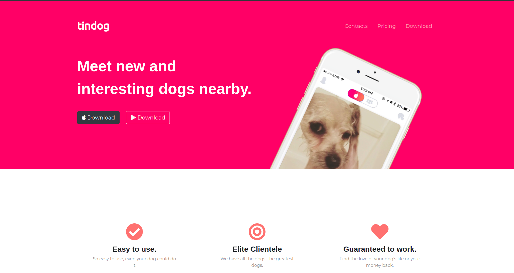

  

# tindog
A dating website design made for dogs.

# Motivation
Create this website to built a UI for a dating website.

# Build Status

# Screenshot

# Tech/Framework Used
**Built with**
1. [HTML5](https://developer.mozilla.org/en-US/docs/Web/HTML)
1. [CSS3](https://developer.mozilla.org/en-US/docs/Web/css)
1. [Bootstrap4](https://getbootstrap.com/)

# How to use?
If want to use this website just go to the this [link](https://tindogsite.netlify.app/) and get motivation from this UI.

# How to contribute?
1. Fork the project.
1. Create a different branch.
1. Add your code to that branch.
1. Create a [pull request](https://docs.github.com/en/github/collaborating-with-issues-and-pull-requests/creating-a-pull-request) 

Made with :heart: and :coffee: by Debajit Mallick

